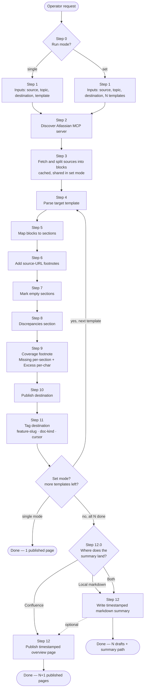

# Documentation Mapper

A Cursor [Agent Skill](https://cursor.com/docs) that takes existing
documentation and reshapes it to fit one or more target templates,
keeping every block traceable back to its source URL and reporting —
honestly — what was lost and what did not fit.

The default proof of concept is **Confluence → Confluence** via the
Atlassian MCP server. Other sources and destinations are out of scope
today but the mapping core is source-agnostic; new connectors only need
to expose their content as MCP tools.

## What the skill does for the operator

1. **Asks for the source(s).** Currently any source reachable through a
   configured MCP server (Confluence today; Jira / Markdown / web are on
   the roadmap). For Confluence a source can be:
   - a single page ID,
   - a parent page ID (descendants are pulled),
   - a CQL query, or
   - a whole space (with a volume warning).
2. **Asks for the topic / feature** being documented — used as the
   destination title prefix and as the canonical label on every
   produced page.
3. **Asks for the destination(s) and the template(s).** Currently
   Confluence. The operator can pick:
   - **single** mode — one destination, one template, one document; or
   - **set** mode — N destinations, each with its own template
     (functional doc, runbook, ADR, …) against the same source set.
4. **Maps source blocks to template sections.** Every block placed in
   the final document keeps a footnote that links back to its
   `source_url`. Source blocks that do not fit any section are
   relocated into a final `Discrepancies` section rather than dropped
   silently.
5. **Adds a per-document coverage footnote** at the very end of every
   produced document, with two deliberately asymmetric metrics:
   - **Missing%** — share of target sections that received nothing
     (section-count basis, conservative — the mapper does not pad
     sections to inflate the score).
   - **Excess%** — share of source content that did not survive the
     mapping (character-count basis, per topic and overall).
6. **In set mode, produces a timestamped overview / coverage summary**
   at the end. The operator chooses where it lands:
   - **Local markdown file** (default) — the cheap option for review
     before publishing anything; or
   - **Confluence page** under the same parent as the drafts; or
   - **Both**.

   The summary lists every draft (template, doc kind, page ID, status,
   URL, Missing%, Excess%) and reports the two cross-document metrics:
   - **Aggregate coverage** — how much of the original source is
     covered by the **union** of all drafts.
   - **Redundancy** — how much content is **duplicated** between
     drafts, with a pairwise (and, when N ≥ 3, triple) overlap table
     pointing at which sections collide.

Both the per-document footnote and the overall summary are kept short:
tables and bullets, no narrative padding.

## Flow

## What you get back

- **Per document (always):** a published / updated page with
  source-URL footnotes on every block, a `Discrepancies` section, and
  a final `Mapping coverage` footnote (Missing% + Excess%).
- **Per run (set mode only):** a timestamped overview / coverage
  summary — locally as markdown or on Confluence — listing every
  draft, the topic, the template, the per-target metrics, and the
  cross-document aggregate-coverage and redundancy numbers.
- **Tags:** every published page is tagged `<feature-slug>`,
  `technical|functional|overview`, `cursor` when the destination
  exposes a label tool; otherwise the labels are emitted as a visible
  body line and the operator is told.

## Repository layout

| Path           | Purpose                                                                 |
|----------------|-------------------------------------------------------------------------|
| `SKILL.md`     | The skill itself — frontmatter + 12-step workflow Cursor follows.       |
| `reference.md` | Tool index, Confluence storage-format notes, AskQuestion templates, worked metrics example, summary template, set-mode formulas. |
| `README.md`    | This file — purpose, user-facing flow, repo layout.                     |

## Requirements

- Cursor with Agent Skills enabled.
- A configured **Atlassian MCP server** in the project for the default
  Confluence-to-Confluence flow. The skill auto-discovers the server
  identifier (`ls mcps/*/tools/getConfluencePage.json`) — it never
  hardcodes a name.
- For local markdown summaries, write access to the chosen path
  (defaults to `<repo-root>/scratch/`).

## Roadmap

- Additional sources: Jira, local Markdown / files, web URLs, mixed.
- Additional destinations: Jira issues (with native `labels`
  support), local Markdown bundles.
- Native Confluence label support once a `*Label*` tool is exposed
  by the Atlassian MCP — the fallback (visible labels line) goes away
  automatically.
