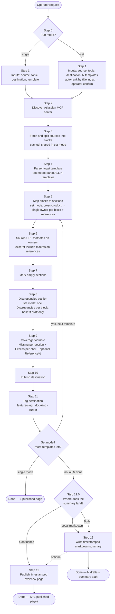

# Documentation Mapper

A Cursor [Agent Skill](https://cursor.com/docs) that takes existing
documentation and reshapes it to fit one or more target templates,
keeping every block traceable back to its source URL and reporting —
honestly — what was lost and what did not fit.

The default proof of concept is **Confluence → Confluence** via the
Atlassian MCP server. Other sources and destinations are out of scope
today but the mapping core is source-agnostic; new connectors only need
to expose their content as MCP tools.

## What the skill does for the operator

1. **Asks for the source(s).** Currently any source reachable through a
   configured MCP server (Confluence today; Jira / Markdown / web are on
   the roadmap). For Confluence a source can be:
   - a single page ID,
   - a parent page ID (descendants are pulled),
   - a CQL query, or
   - a whole space (with a volume warning).
2. **Asks for the topic / feature** being documented — used as the
   destination title prefix and as the canonical label on every
   produced page.
3. **Asks for the destination(s) and the template(s).** Currently
   Confluence. The operator can pick:
   - **single** mode — one destination, one template, one document; or
   - **set** mode — N destinations, each with its own template
     (functional doc, runbook, ADR, …) against the same source set.
4. **Asks the operator explicitly for the template location.** Before
   any scanning, the operator picks one of: a folder/parent page
   (children become the candidate list), a list of distinct
   page/template IDs, or — in set mode only — an auto-scan of the
   destination space.
5. **In set mode, derives a reading order from the template titles.**
   A leading alpha-numerical index (`1.`, `2.1`, `[3]`, `A.`, `B1)` …)
   is detected per template; templates are sorted by natural sort on
   the index. Mixed schemes (numeric + alpha) are surfaced as a soft
   warning and the operator can still confirm. When the hierarchy is
   **not inferrable** (no index, mixed indexed/unindexed templates, or
   duplicate indices), the run is **hard-blocked**: the operator must
   specify the order explicitly before anything is published. The
   detected index is **stripped** from the destination title — the
   order lives in the consolidated plan and the overview's drafts
   table, not in page titles.
6. **In set mode, de-duplicates content across drafts by reference,
   with parent-priority.** Each source block has **exactly one owner**
   across the whole set, and the owner is the **earliest-ranked**
   template (lowest rank index) whose best section scores ≥ threshold
   — the parent draft is the source of truth, even when a child draft
   would semantically be a better fit. The reference graph is
   therefore strictly backward (later rank → earlier rank), acyclic,
   and contains zero parent → child references. Every other draft
   that wants the same block
   emits a Confluence `excerpt-include` macro pointing at the owner
   instead of copying the body. Excess blocks land in **one** draft's
   `Discrepancies` section (the best-fit-but-below-threshold draft),
   never in multiple. The body of any given piece of information lives
   in exactly one place across the set.
7. **Maps source blocks to template sections.** Every block placed in
   the final document keeps a footnote that links back to its
   `source_url`. Source blocks that do not fit any section are
   relocated into a final `Discrepancies` section rather than dropped
   silently.
8. **Adds a per-document coverage footnote** at the very end of every
   produced document, with two deliberately asymmetric metrics (plus
   an optional one in set mode):
   - **Missing%** — share of target sections that received nothing
     (section-count basis, conservative — the mapper does not pad
     sections to inflate the score).
   - **Excess%** — share of source content that did not survive the
     mapping (character-count basis, per topic and overall). In set
     mode, only **owned** chars count toward the retained denominator
     — `excerpt-include` references do not inflate this draft's
     volume.
   - **Reference%** (set mode only, optional) — share of this draft's
     sections that are reference-only macros, useful to tell the
     reader how "thin" the doc is on its own.
9. **In set mode, produces a timestamped overview / coverage summary**
   at the end. The operator chooses where it lands:
   - **Local markdown file** (default) — the cheap option for review
     before publishing anything; or
   - **Confluence page** under the same parent as the drafts; or
   - **Both**.

   The summary lists every draft (`# · Rank · Template · Doc kind ·
   Title · Page ID · Status · URL · Missing% · Excess%`) and reports
   the cross-document metrics:
   - **Aggregate coverage** — share of the source set owned by at
     least one draft (references do not add new coverage).
   - **Reference map** — for each pair of drafts, how many chars of
     `excerpt-include` traffic flow between them, sorted by volume.
     Replaces the old "redundancy" section, which collapses to ~0%
     by construction under the single-owner rule.
   - **Dedup ratio** — share of body content that would have been
     duplicated if drafts had been emitted independently and was
     absorbed into cross-reference macros instead.

Both the per-document footnote and the overall summary are kept short:
tables and bullets, no narrative padding.

## Flow

## What you get back

- **Per document (always):** a published / updated page with
  source-URL footnotes on every owned block, an
  `excerpt-include` macro per referenced section (set mode only), a
  `Discrepancies` section (only when this draft holds excess), and a
  final `Mapping coverage` footnote (Missing% + Excess% + optional
  Reference%).
- **Per run (set mode only):** a timestamped overview / coverage
  summary — locally as markdown or on Confluence — listing every
  draft, the topic, the template, the per-target metrics, and the
  cross-document aggregate-coverage + reference-map + dedup-ratio
  numbers.
- **Tags:** every published page is tagged `<feature-slug>`,
  `technical|functional|overview`, `cursor` when the destination
  exposes a label tool; otherwise the labels are emitted as a visible
  body line and the operator is told.

## Repository layout

| Path           | Purpose                                                                 |
|----------------|-------------------------------------------------------------------------|
| `SKILL.md`     | The skill itself — frontmatter + 12-step workflow Cursor follows.       |
| `reference.md` | Tool index, Confluence storage-format notes, AskQuestion templates, set-mode de-duplication algorithm + macro snippets, worked metrics example, summary template, set-mode formulas. |
| `README.md`    | This file — purpose, user-facing flow, repo layout.                     |

## Requirements

- Cursor with Agent Skills enabled.
- A configured **Atlassian MCP server** in the project for the default
  Confluence-to-Confluence flow. The skill auto-discovers the server
  identifier (`ls mcps/*/tools/getConfluencePage.json`) — it never
  hardcodes a name.
- For local markdown summaries, write access to the chosen path
  (defaults to `<repo-root>/scratch/`).

## Roadmap

- Additional sources: Jira, local Markdown / files, web URLs, mixed.
- Additional destinations: Jira issues (with native `labels`
  support), local Markdown bundles.
- Native Confluence label support once a `*Label*` tool is exposed
  by the Atlassian MCP — the fallback (visible labels line) goes away
  automatically.
